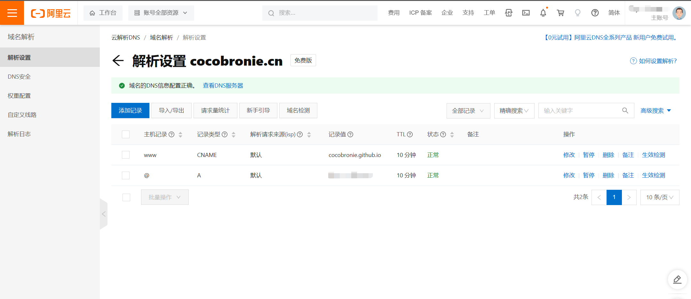
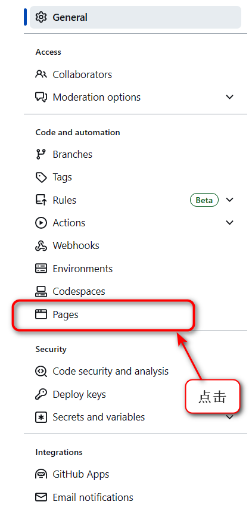

# vitepress构建我的笔记页面

## 前言

- **为什么用vitepress而不是vuepress**：vitepress基于vite构建项目，vuepress基于webpack，vitepress更快。
- **为什么用yarn而不是npm**：官网用的yarn，而且yarn更快

## 1、初始化

**参考：**[VitePress 手把手完全使用手册 - 掘金 (juejin.cn)](https://juejin.cn/post/7164276166084263972#heading-15)

**参考：**[十分钟用vitepress搭建项目文档 - 知乎 (zhihu.com)](https://zhuanlan.zhihu.com/p/605300455)

**官方文档**：[Using Vue in Markdown | VitePress](https://vitepress.dev/guide/using-vue)

- 一开始构建出来的界面出现中文乱码，解决：[(92条消息) VuePress 的md文件内容显示乱码解决方案_吉尔想放假的博客-CSDN博客](https://blog.csdn.net/qq_45611841/article/details/115832233)

### 1.1   docs/index.md 中定义首页

- `VitePress` 的布局整体可以分为 4 种：`doc` 、`page` 、`home` 和 没有任何默认布局（空白页面），布局语法：

```markdown

需要注意的是，下面的语法一定要写在 md 文档的头部才会生效
---
layout: doc（文档页） | page | home（首页）
---

// 通过此语法可以将整个页面变成空白页面，适合自定义的布局
{{ $formatter.layout }}


```

**示例：**

```markdown
---
layout: home

hero:
  name: Cocolib
  text: 我的前端笔记库
  tagline: 
  image:
    src: /images/logo.png
    alt: 网站的 logo 图片
  actions:
    - theme: brand
      text: 快速开始
      link: /guide/what-is-vitepress
    - theme: alt
      text: 在 github 上查看
      link: https://github.com/vuejs/vitepress
features:
  - icon: ⚡️
    title: 这里是功能区 1
    details: 这里是功能区 1 详情信息
  - icon: 🖖
    title: 这里是功能区 2
    details: 这里是功能区 2 详情信息
  - icon: 🛠️
    title: 这里是功能区 3
    details: 这里是功能区 3 详情信息
---

```


### 1.2  docs/.vitepress/config.js中配置 

1. **导航栏：**`Nav` 配置有两种方式，直接点击跳转和下拉菜单样式。

- `link`：当触发点击事件时跳转的地址；可以是外链也可以是项目内的路径。
- `activeMatch`： 需要被高亮的 `nav` 。
- `text`：显示到页面的信息。

2. **社交链接**：`socialLinks`

- `icon`：`discord` `facebook` `github` `instagram` `linkedin` `slack` `twitter` `youtube` 或者 `svg` 字符串
- `link`：跳转链接。


3. **侧边栏导航：**`Sidebar`  同样有两种配置方式

- `text`：侧边栏块的 `title`。
- `items`：侧边栏的每一项，`text` 为标题；`link` 为跳转地址。
- `collapsible`：菜单是否为可折叠的 `Boolean`。
- `collapsed`：是否默认折叠 `Boolean` 只有配置 `collapsiable` 时此配置才会生效。


4. **静态资源与导航路由的路径书写规则**

- **静态资源**：推荐放入 `/docs/public` 文件夹中。随后在 `md` 中使用时以 ``。 `/` 以 `public` 开始。

- **路径配置规则**：以 `/docs` 为根目录，进行配置；`/` 以 `docs` 开始。

5. **上下翻页** 

此功能虽是默认提供，也可以通过配置来定制默认的文字。

```js
docFooter: { prev: '上一篇', next: '下一篇' }
```

6. **在 `Github` 编辑此页**

```js
 editLink: {
      pattern: 'https://github.com/vuejs/vitepress/edit/main/docs/:path',
      text: 'Edit this page on GitHub'
    }
```

7. **最后更新时间**

```js
lastUpdated: true,
themeConfig: {
	lastUpdatedText: "最近更新时间"
}
```

8. **主 `title` 内容与图片配置**

```js
 title: '自定义的 title',
 themeConfig: {
    logo: '/test.jpg',
  }
```


9. **打包后输出目录的配置**

```js
outDir: '../dist'
```

10. **`markdown` 主题配置**

```
markdown: {             //markdown配置
        theme: 'material-palenight',//md主题
        lineNumbers: true//md 加行号
},
```

11. **`description` 配置**

会显示页面中 `<meta name="description" content="xxxx">` 

```js
description: '自定义的 description',
```

12. **页脚配置**

页脚通过 `footer` 进行配置。**如果 `Sidebar` 存在则页脚不会存在**

```
themeConfig: {
    footer: {
      message: 'Released under the MIT License.',
      copyright: 'Copyright © 2019-present Evan You'
    }
  }
```

13. **目录**

```js
outlineTitle: '目录'
```

14. **`head`配置**

这里是给网页配置图标

```js
  head:[
        ['link', { rel: 'icon', href: '/favicon.ico' }]
   ]
```


## 2、部署到GitHub中

### 2.1 一个域名如何部署两个网站（需要宝塔）

**参考：**[10分钟让你彻底理解如何配置子域名来部署多个项目 - 掘金 (juejin.cn)](https://juejin.cn/post/7064024606276845581)

因为我的`Blog`是部署在了`github page`上，并且绑定了我之前申请的域名，这个网站的话，我也想部署在我的域名里。

1. **添加CNAME记录**

在域名服务商那里，加一个，把需要配置的子域名指向根域对应的主机名即可。



- **什么情况下会用到CNAME记录？**

如果需要将域名指向另一个域名，再由另一个域名提供ip地址，就需要添加CNAME记录
最常用到CNAME的情况包括：**做CDN，配置子域名**

- **点击添加记录**

**记录类型：**选择 `CNAME`

**主机记录：**填子域名（比如需要添加 myblog.zhangjiancong.top的解析，只需要在主机记录处填写 myblog 即可；如果添加 zhangjiancong.top的解析 的解析，主机记录直接留空，系统会自动填一个“@”到输入框内）。

**解析线路：**默认即可（如果不选默认会导致部分特定用户无法解析；在上图中的作用为：除了联通用户之外的所有用户都可正常解析）

**记录值：**CNAME 指向的域名，只可以填写域名，记录生成后会自动在域名后面补一个“.”，这是正常现象

**TTL：**添加时系统会自动生成，默认为600秒（TTL为缓存时间，数值越小，修改记录各地生效时间越快）。

**……后来发现需要宝塔，我就没用了**


### 2.2 如何拥有多个GitHub Pages

**参考：**[如何拥有多个GitHub Pages - 知乎 (zhihu.com)](https://zhuanlan.zhihu.com/p/183977963)

**官方文档：**[关于 GitHub Pages - GitHub 文档](https://docs.github.com/zh/pages/getting-started-with-github-pages/about-github-pages)

有三种类型的 GitHub Pages 站点：**项目**、**用户**和**组织**。 项目站点连接到 GitHub 上托管的特定项目。 用户和组织站点连接到特定的 GitHub 帐户。

- 要发布用户站点，必须创建名为 `<user>.github.io` 的用户帐户所拥有的仓库。 
- 要发布组织站点，必须创建名为 `<organization>.github.io` 的组织所拥有的仓库。
-  除非您使用自定义域，否则用户和组织站点位于 `http(s)://<username>.github.io` 或 `http(s)://<organization>.github.io`。

- 项目站点的源文件与其项目存储在同一个仓库中。 除非您使用自定义域，否则项目站点位于 `http(s)://<user>.github.io/<repository>` 或 `http(s)://<organization>.github.io/<repository>`。

您只能为每个 GitHub 帐户创建一个用户或组织站点。 项目站点（无论是组织还是用户帐户拥有）没有限制。

1. 新建一个仓库，名字随意，我这里是publish的，不知道private行不行
2. 进入仓库主页，点击`Settings`，点击`Pages`



3. 选一个分支，保存


4. 等待页面加载，会出现一个`Custom domain`，填入之前在域名商中注册过的**子域名**


### 2.3 部署vitepress到GitHub上

1. 根目录新建 `deploy.sh` 文件。并复制以下内容稍微修改。

```sh
#!/usr/bin/env sh

# 确保脚本抛出遇到的错误
# set -e		添加这句报错！！！！！！！！！！

# 删除文件需要根据实际打包的目录进行删除
rm -rf docs/.vitepress/dist/

# 生成静态文件
yarn docs:build

# 进入生成的文件夹
cd docs/.vitepress/dist

# 如果是发布到自定义域名
# echo 'www.example.com' > CNAME

git init
git add -A
git commit -m 'deploy'

# 如果发布到 https://<USERNAME>.github.io 修改仓库地址
# git push -f git@github.com:<USERNAME>/<USERNAME>.github.io.git main:master  #注意这里我的默认分支是：main，要推送到master分支去

cd -

```

2. **复制代码到`config.js`，注意 `Repository name` 和本地的 `base` 配置相同**（后来删掉了，因为这样会让页面没有CCS样式）

```js
export default defineConfig({
  base: '/your-github-repository/'
})
```

3. `package.json` 中新增脚本并执行，等个三两分钟直接访问 `https://your-github.github.io/your-github-repository/`。

```json
json复制代码"scripts": {
  "deploy": "bash deploy.sh"
}
```

如果遇到异常 参考 [VuePress 搭建组件库文档](https://juejin.cn/post/7064746265266880549#heading-18) [VuePress 部署](https://link.juejin.cn?target=https%3A%2F%2Fvuepress.vuejs.org%2Fzh%2Fguide%2Fdeploy.html)

3. `yarn docs:build `构建项目
4. 我在VScode的终端操作总是报各种各样的错，只能在项目的根目录`git bash here` ，然后输入` bash deploy.sh`

**上线成功！！**
